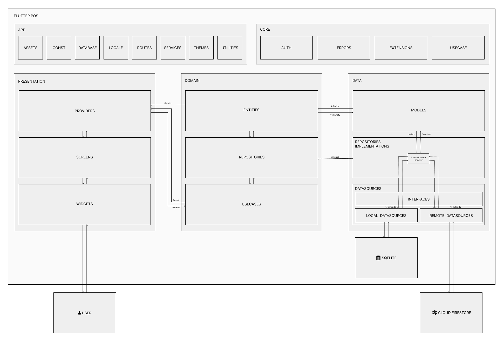
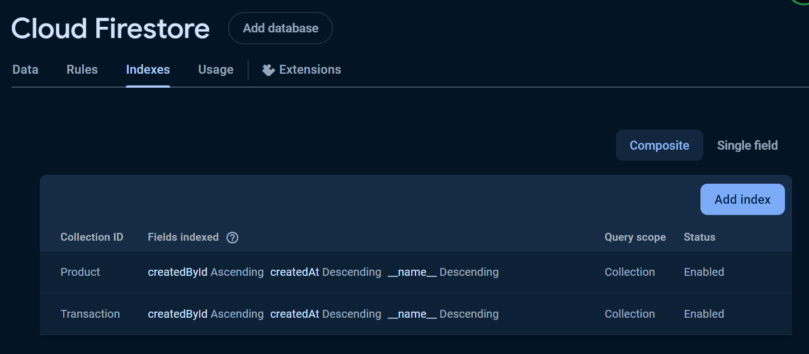

# Flutter POS
[](./LICENSE)
[](https://flutter.dev/)

A simple Point of Sale (POS) application built with Flutter with clean architecture design. The application is designed to be used both online and offline. The application's local data (sqflite) will be automatically synchronized with the cloud data (firestore) when the application detects an internet connection.

This application uses an offline-first approach, where data will be stored in the local database first and then in the cloud database if there is an internet connection. If there is no internet connection, all actions performed by the user (create, update, delete) will be recorded as 'QueuedActions' in local database and will be executed automatically when the internet connection available.
<br/>
<br/>
<p align="left">
  
  
  
  
  
</p>

## Demo APK
[Download Demo APK](https://github.com/elrizwiraswara/flutter_pos/releases)

## Features

- **Product Management**: Add, update, and delete products.
- **Sales Tracking**: Record and manage sales transactions.
- **User Authentication**: Secure login and user management.
- **Responsive UI**: Used Material UI 3, support dark & light mode, and user-friendly error handler UI.
- **Customizeable Theme**: Customizeable & adaptive theme colors, text-style, etc.

## Architecture


## Getting Started

### Prerequisites

- [Flutter](https://flutter.dev/docs/get-started/install)
- [Dart](https://dart.dev/get-dart)
- Firebase account for backend services

### Installation

1. **Clone the repository:**
    ```sh
    git clone https://github.com/elrizwiraswara/flutter_pos.git
    cd flutter_pos
    ```

2. **Install dependencies:**
    ```sh
    flutter pub get
    ```

3. **Set up Firebase:**
    - Create a new project on [Firebase](https://firebase.google.com/).
    - Follow the instructions to add Firebase to your Flutter app [here](https://firebase.google.com/docs/flutter/setup).
    - Enable google authentication provider
    - Update cloud firestore rules to allow read write operation
    <br/>

    ```
    service cloud.firestore {
      match /databases/{database}/documents {
        match /{document=**} {
          allow read, write: if request.auth != null;
        }
      }
    }
    ```
    - Add cloud firestore indexes to enable query
    <br/>
    
    <br/>
    <br/>
    
    - Update firebase storage rules to allow read write operation
    <br/>

    ```
    service firebase.storage {
      match /b/{bucket}/o {
        match /{allPaths=**} {
          allow read, write: if request.auth != null;
        }
      }
    }
    ```


4. **Run the application:**
    ```sh
    flutter run
    ```

### Test

To test the application, run the following command:
```sh
flutter test
```

## Contributing

Contributions are welcome! Please open an issue or submit a pull request for any bugs, feature requests, or improvements.

## License

This project is licensed under the MIT License - see the [LICENSE](LICENSE) file for details.

## Support

<a href="https://trakteer.id/elrizwiraswara/tip" target="_blank"></a>
