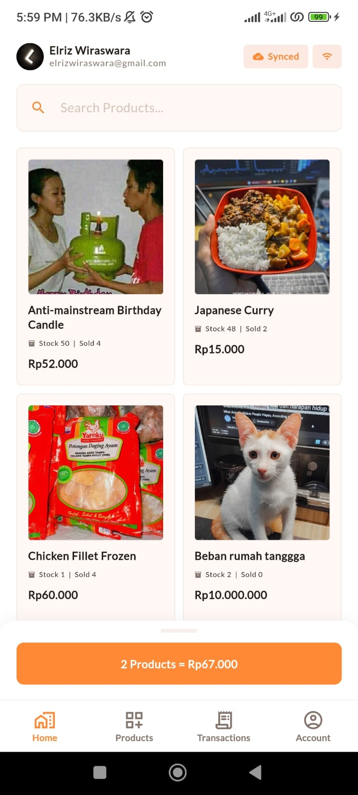
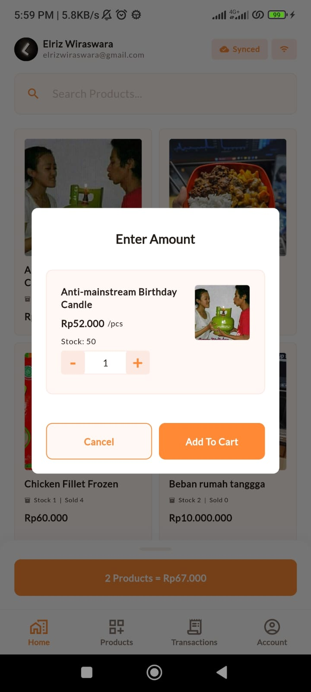
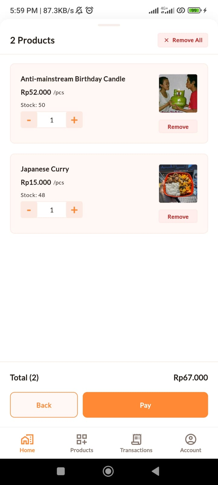
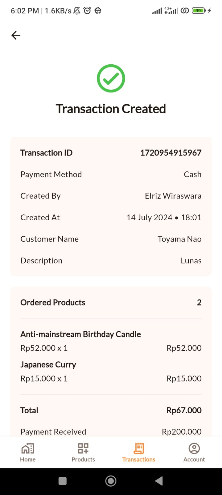
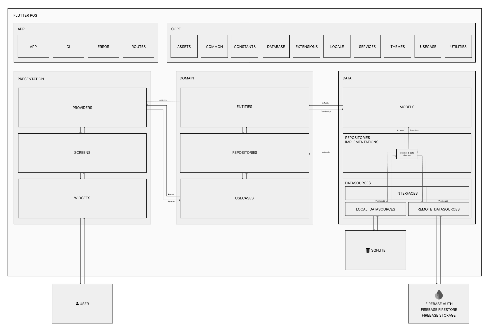
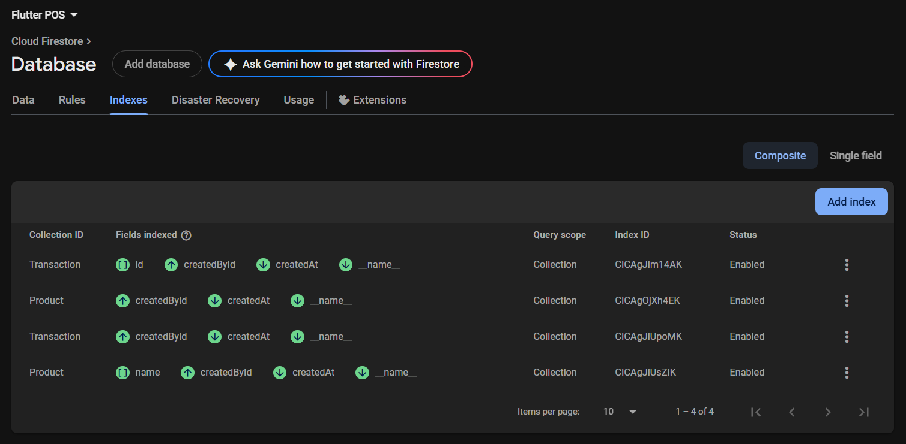

# Flutter POS
[](./LICENSE)
[](https://flutter.dev/)

A Point of Sale (POS) application built with Flutter, demonstrating **Clean Architecture** principles and **offline-first** design patterns. This project serves as a learning resource and reference implementation for building Flutter apps with proper architecture and automatic data synchronization between local storage (SQLite) and cloud database (Firestore).

The app prioritizes local-first operations, storing all data in SQLite and automatically syncing with Firestore when online. When offline, all user actions (create, update, delete) are recorded as `QueuedActions` in the local database and automatically executed in sequence when internet connectivity is restored.

<br/>
<p align="left">
  
  
  
  
  
</p>

## Demo APK
[Download Demo APK](https://github.com/elrizwiraswara/flutter_pos/releases)

## Features

### Core Functionality
- **Product Management**: Full CRUD operations for products with image upload support
- **Sales Transactions**: POS interface with cart management and transaction history
- **User Authentication**: Firebase Authentication with Google Sign-In integration
- **Account Management**: User profile management and settings

### Technical Implementation
- **Offline-First Architecture**: Works seamlessly without internet connection
- **Automatic Data Sync**: SQLite ↔ Firestore bidirectional synchronization
- **Queued Actions**: Automatic retry mechanism for offline operations (create, update, delete)
- **Clean Architecture**: Separation between presentation, domain, and data layers
- **State Management**: Provider pattern for state management
- **Dependency Injection**: Centralized DI setup for better code organization
- **Unit Testing**: Tests for datasources, repositories, and use cases
- **Material Design 3**: Material design 3 and Dark & Light theme switching support
- **Customizable Theming**: Adjustable colors and typography
- **Multi-Platform**: Supports Android, iOS, Windows, macOS, and Linux
- **Error Handling**: User-friendly error messages and states
- **Reusable Widgets**: Custom UI components for consistent design

## Architecture


## Project Structure

```
flutter_pos/
├── lib/
│   ├── app/                          # Application setup and configuration
│   │   ├── di/                       # Dependency injection
│   │   ├── error/                    # Error handling
│   │   └── routes/                   # App routing and navigation
│   │
│   ├── core/                         # Core utilities and shared resources
│   │   ├── assets/                   # Asset management
│   │   ├── common/                   # Common utilities (Result wrapper)
│   │   ├── constants/                # App constants
│   │   ├── database/                 # Local database configuration (sqflite)
│   │   ├── extensions/               # Dart extensions
│   │   ├── locale/                   # Localization
│   │   ├── services/                 # Core services
│   │   │   ├── connectivity/         # Network connectivity checking
│   │   │   ├── info/                 # Device info service
│   │   │   └── logger/               # Error logging service
│   │   ├── themes/                   # App theming (colors, sizes, themes)
│   │   ├── usecase/                  # Base usecase interface
│   │   └── utilities/                # Helper utilities (formatters, loggers, etc.)
│   │
│   ├── data/                         # Data layer
│   │   ├── datasources/              # Data sources
│   │   │   ├── interfaces/           # Datasource interfaces
│   │   │   ├── local/                # Local datasources (sqflite)
│   │   │   └── remote/               # Remote datasources (Firestore, Firebase Auth)
│   │   ├── models/                   # Data models with JSON serialization
│   │   └── repositories/             # Repository implementations
│   │
│   ├── domain/                       # Domain layer (Business logic)
│   │   ├── entities/                 # Business entities
│   │   ├── repositories/             # Repository interfaces
│   │   └── usecases/                 # Use cases (business logic operations)
│   │
│   ├── presentation/                 # Presentation layer (UI)
│   │   ├── providers/                # State management (Provider)
│   │   │   ├── account/              # Account-related state
│   │   │   ├── auth/                 # Authentication state
│   │   │   ├── home/                 # Home screen state
│   │   │   ├── main/                 # Main navigation state
│   │   │   ├── products/             # Products management state
│   │   │   ├── theme/                # Theme state
│   │   │   └── transactions/         # Transactions state
│   │   ├── screens/                  # UI screens
│   │   │   ├── account/              # Account screens
│   │   │   ├── auth/                 # Authentication screens
│   │   │   ├── error/                # Error screens
│   │   │   ├── home/                 # Home/POS screen
│   │   │   ├── main/                 # Main navigation screen
│   │   │   ├── products/             # Product management screens
│   │   │   └── transactions/         # Transaction history screens
│   │   └── widgets/                  # Reusable UI components
│   │
│   ├── firebase_options.dart         # Firebase configuration
│   └── main.dart                     # App entry point
│
├── test/                             # Unit and widget tests
│   ├── core/services/                # Service tests
│   ├── data/                         # Data layer tests
│   │   ├── datasources/              # Datasource tests
│   │   └── repositories/             # Repository tests
│   ├── domain/usecases/              # Usecase tests
│   └── presentation/screens/         # Screen tests
│
├── assets/                           # Static assets
├── android/                          # Android platform files
├── ios/                              # iOS platform files
├── linux/                            # Linux platform files
├── macos/                            # macOS platform files
├── web/                              # Web platform files
├── windows/                          # Windows platform files
│
├── analysis_options.yaml             # Dart analyzer configuration
├── pubspec.yaml                      # Package dependencies
└── README.md                         # Project documentation
```

## Getting Started

### Prerequisites

- [Flutter](https://flutter.dev/docs/get-started/install)
- [Dart](https://dart.dev/get-dart)
- Firebase account for backend services

### Installation

1. **Clone the repository:**
    ```sh
    git clone https://github.com/elrizwiraswara/flutter_pos.git
    cd flutter_pos
    ```

2. **Install dependencies:**
    ```sh
    flutter pub get
    ```

3. **Set up Firebase:**
    - Create a new project on [Firebase](https://firebase.google.com/).
    - Follow the instructions to add Firebase to your Flutter app [here](https://firebase.google.com/docs/flutter/setup).
    - Enable google authentication provider
    - Update cloud firestore rules to allow read write operation
    <br/>

    ```
    service cloud.firestore {
      match /databases/{database}/documents {
        match /{document=**} {
          allow read, write: if request.auth != null;
        }
      }
    }
    ```
    - Add cloud firestore indexes to enable query
    <br/>
    
    <br/>
    <br/>
    
    - Update firebase storage rules to allow read write operation
    <br/>

    ```
    service firebase.storage {
      match /b/{bucket}/o {
        match /{allPaths=**} {
          allow read, write: if request.auth != null;
        }
      }
    }
    ```

5. **Set up your `config.json` file**
    <br/> `GOOGLE_SERVER_CLIENT_ID` is `Web client ID` that you can get from your Firebase Google sign-in method provider 

    ```
    {
      "GOOGLE_SERVER_CLIENT_ID": "xxxxxxxxxxxxx.apps.googleusercontent.com"
    }
    ```

5. **Run the application:**
    ```sh
    flutter run --dart-define-from-file config.json
    ```

### Test

To test the application, run the following command:
```sh
flutter test --coverage
```
To view the test coverage you can use `genhtml` or [test_cov_console](https://pub.dev/packages/test_cov_console)

## Contributing

Contributions are welcome! Please open an issue or submit a pull request for any bugs, feature requests, or improvements.

## License

This project is licensed under the MIT License - see the [LICENSE](LICENSE) file for details.
